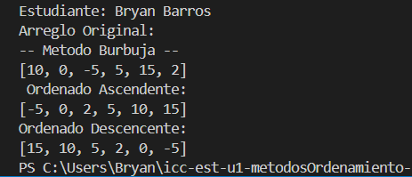
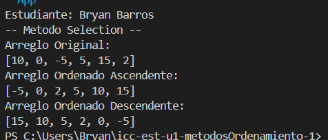
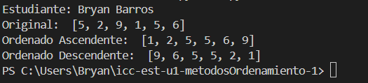
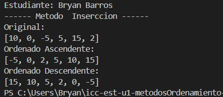
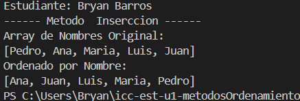
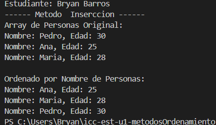
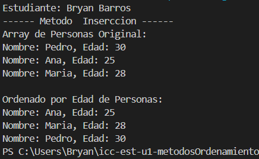

# Estructura de Datos

- **Carrera:** Computación
- **Estudiante:** Bryan Barros
- **Fecha:** 25/10/2025
- **Profesor:** Ing. Pablo Torres 

---

## Métodos de Ordenamiento

En este repositorio se encuentran las implementaciones de diferentes métodos de ordenamiento:

1. Bubble Sort  
2. Selection Sort  
3. Insertion Sort 

---
> Nota: Los bloques de código de cada método están comentados.  
> Si se desea ejecutar los otros métodos o ver los pasos intermedios, se pueden descomentar sin problemas.

---

### 📘 Práctica 1 - 20/OCT
#### Método Bubble Sort

---

### 📘 Práctica 2 - 21/OCT
#### Método Selection Sort en Java y Python

---

## 📗 Práctica 3 - Insertion Sort

### 1️⃣ Arreglo de números enteros  

### 2️⃣ Arreglo de cadenas (nombres)  

### 3️⃣ Arreglo de personas ordenado por nombre  

### 4️⃣ Arreglo de personas ordenado por edad  

