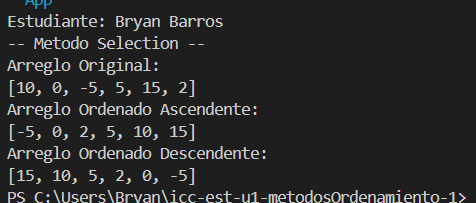

# Estructura de Datos

**Estudiante :** Diana Borja

## Métodos Ordenamiento

### Práctica 1 - 20/OCT
Metodo Sort Bubble

### Práctica 2 - 21/OCT
Método Sort Selection en Java y Python

## Resultado de Salida de Python 

## Resultado de Salida de Java
 
